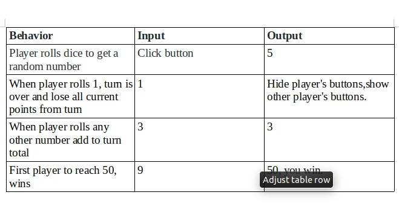

## Pig Dice

## By Oscar Ngolo

## Description

A simple dice game. Each turn, a player repeatedly rolls a die until either a 1 is rolled or the player decides to "hold":

If the player rolls a 1, they score nothing and it becomes the next player's turn.
If the player rolls any other number, it is added to their turn total and the player's turn continues.
If a player chooses to "hold", their turn total is added to their score, and it becomes the next player's turn.
The first player to score 50 or more points wins.

## Specs

;

## Setup/Installation Requirements

To use the code, you can clone the repository at: https://github.com/oscarngolo/pig-dice.

$ git clone https://github.com/oscarngolo/pig-dice.git
$ cd pig-dice
Then run through it to your local machine then push to your repository.

## Support and contact details

Feel free to reach out with suggestions, contact person, Oscar Ngolo.

## Technologies Used

Main Languages used:
HTML
CSS
JavaScript
jQuery

## Other Technologies:

Bootstrap

## License

This project is licensed under the MIT License
Oscar Ngolo Copyright (c) 2018
